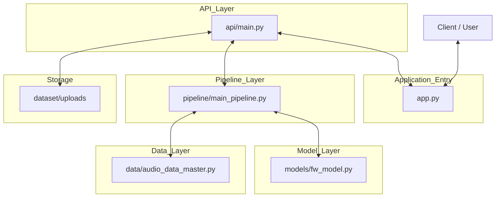

# AutoSeg 
Repository for AutoSeg, made as part of the tahe home coding technical test for a company. 

## Dataset 
Dataset used to test is taken from a sample of [Fisher English Training Speech](https://catalog.ldc.upenn.edu/LDC2004S13)

## Instructions 
### Setup and Installation 
Follow the steps below to set up the project locally.

#### 1. Clone the Repository
```bash
git clone https://github.com/your-username/autoseg.git
cd autoseg
```
#### 2. Create python environment 
You can use either **Conda** or **Python venv**.

**Conda**
```bash
conda create -n AutoSeg python=3.10
```
```bash
conda activate AutoSeg
```

**Python Venv**
```bash
python -m venv venv
```

###### ***Windows***
```bash
venv\Scripts\activate
```
###### ***Mac/LinusOS***
```bash
source venv/bin/activate
```
#### 3. Install requirements
```bash
pip install -r "requirements.txt" 
``` 


### Run the API and Streamlit App
There are 2 main components you can run and demonstrate:

**Step 1 — Run the FastAPI Backend**

Navigate to the project root directory and run:

```uvicorn src.api.main:app --reload```

The API will start at:

http://127.0.0.1:8000

You can test it using:

http://127.0.0.1:8000/docs

**Step 2 — Run the Streamlit Frontend**

In a new terminal, run:

```streamlit run src/app.py```

The Streamlit app will open automatically in your browser. 


## Architect Visualization
### System Architecture

The system follows a layered architecture:
1. Client interacts with the application through `app.py`.
2. `api/main.py` exposes endpoints for processing requests.
3. The processing logic is handled in `pipeline/main_pipeline.py`.
4. The pipeline handles audio data manipulation through `audio_data_master.py`.
5. Speech segmentation is performed using `fw_model.py`.
6. Audio files are stored and accessed from the storage layer.

### User Processing Pipeline

### Processing Pipeline Explanation

The system processes audio through a multi-stage pipeline designed to improve transcription accuracy and efficiency.

1. **Input Audio**  
   The pipeline begins with a raw audio file provided by the user.

2. **Raw Full-Audio Transcription**  
   The entire audio file is first transcribed to generate the baseline transcription.

3. **Silent / Non-Silent Segmentation**  
   The audio is analyzed to separate **silent segments** from **non-silent/speech segments**, isolating portions that actually contain speech.

4. **Segment-Based Transcription**  
   Only the **detected non-silent segments** are transcribed individually, allowing the model to focus speech segments solely and ignore silent segments.

5. **Confidence-Based Re-segmentation**  
   The system evaluates the **confidence score** of each transcription segment. Segments with confidence below a defined threshold are **isolated** and **re-transcribed individually** to improve accuracy using the model.

## System Assessment
### System Description
The system's main technical components are:- 
* ***Faster Whisper***: Faster Whisper is a reimplementation of OpenAI's Whisper model using CTranslate2, which is a fast inference engine for Transformer models. Essentially it  is OpenAI's Whisper model but faster. This is used because it is the standard SOTA STT model with loads of documentation and support. We use the "small" model here to allow the STT app to run smoothly on local devices. 
* ***PyDub Silence***: We use the silence detection method from the **PyDub** library. It uses a simple heuristic volume method and does not distinguish between machine and human sounds. It operates purely on volume. We use this because it doesn't take too much resources and is fairly quick which is important as this program must run purely on local. 
### System Review
Unfortunately the results of the models were quite limited and left a lot to be desired. While initial raw transcriptions provided a good baseline with passable results, post-processing results (**silent-based segmentation** and **confidence-based resegmentation**) actually made it worse (in terms of **log-prob**). This could be because of many things but I suspect:-
* **Faster Whisper Small** is too simple of a model and couldn't perform well enough, especially when forced to transcribe smaller segments (could be too dependant on contextual audio cues)
* **PuDyb Silence** uses a simple heuristic volume method, it does not distinguish between machine and human voices. As the sample audio uses contain static noise in the background this oculd throw the algorithm off.  
### Future Improvements
Several improvements could enhance the system’s performance. First, using a larger **Faster Whisper model** (e.g., medium or large) could improve transcription accuracy, though this would require more computational resources which is the main **trade-off**. 

Second, replacing **PyDub’s** volume-based silence detection with a more advanced **voice activity detection (VAD)** method could produce better segmentation by distinguishing speech from background noise.

Finally, the segmentation strategy could be improved. The current system applies **segmentation** based on **silence** and then attempts **confidence-based resegmentation** when the **transcription confidence is low**. However, Whisper models are known to **rely heavily on contextual audio information**. When segments become too small, **the model may lose contextual information** that helps it correctly predict words. Future work could explore **hybrid segmentation approaches** where segmentation also occurs when there are linguistic cues for a sentence ender/speaker change. 
